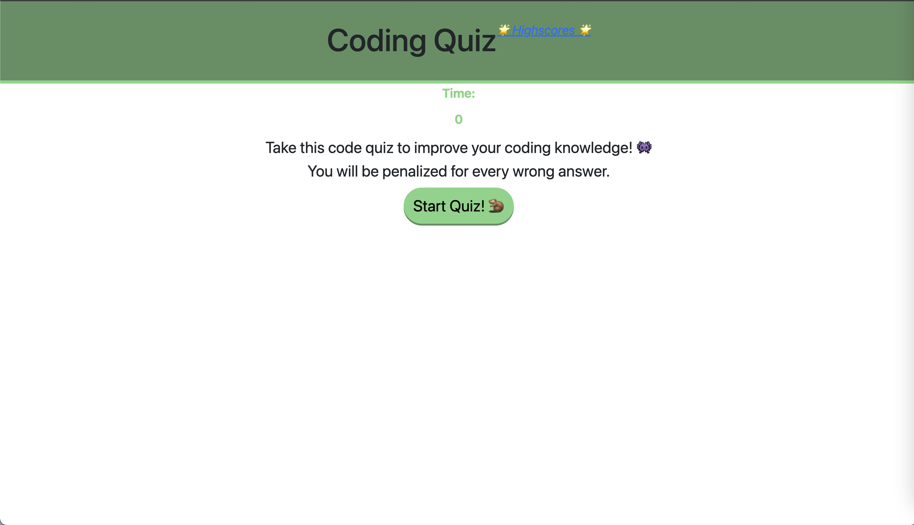

# Code-Quiz-W4

This projects purpose is to test our technical and practical knowledge and application of what we've learned so far. 
 
With this project we will create a Code quiz testing what we know while applying it to the very same site.
 
This quiz will consist of a timer countdown clock, a penalty system for any and all wrong answers and a score tracker of our performance.
 
If ive got time ill glam it up and put my own flair on it.

